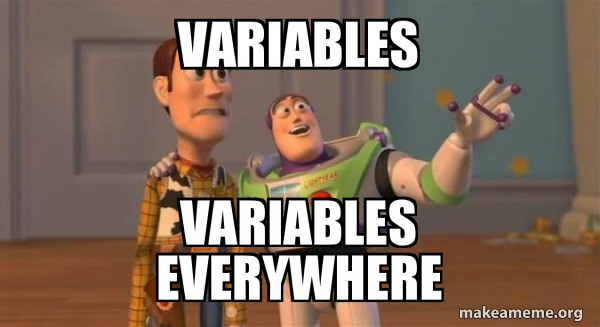

# 01 Les variables

{: .center} 

Écrire un programme, c'est traiter des données. Le plus souvent numériques (entiers ou décimaux) en cours de Mathématiques ou de Physique-Chimie, elles peuvent être aussi d'autres *types*: chaîne de caractères (texte), booléens (vrai/faux), ...

Pour stocker, manipuler et modifier ces données au fil du programme, on crée des *variables* qui vont permettre de les nommer ces données et  d'y avoir accès simplement.

## 1. Affectation

Admettons qu'on souhaite programmer un jeu de combat de Pokémons (ou tout autre personnage). Dans ce programme il faudra prendre en compte de nombreux attributs des Pokémons, par exemple les points de vie (PV). Pour chaque Pokémon, ces PV sont assez évidemment amenés à varier tout au long de l'exécution du programme. Le programmeur ne peut donc pas connaître la **valeur** de ces PV pendant le programme. Il lui faut manipuler une variable, c'est à dire un **nom associé à cette valeur**, qui elle est stockée en mémoire.

!!! abstract "Notion de variable"
    - Une variable est une **association** entre un **nom** et une **valeur**.

    - Associer une valeur à une variable (nouvelle ou déjà créé) s'appelle une **affectation**. 

    Par exemple, si mon Pokémon a 80 points de vie en début de partie, je peux créer une variable en affectant la valeur 80 au nom `pv`.

    En Python, on écrira:

    ```python
    pv = 80
    ```

!!! info "Vocabulaire"
    - Par abus de langage, on confond souvent *variable* et *nom de variable*. Ici on parlera de la variable `pv`.

    - La première fois qu'on affecte une valeur à une variable, on dit qu'on **l'initialise**.

!!! warning "Attention"
    - Le symbole `=` n'a **rien à voir** avec le symbole = utilisé en mathématiques. 
    - On commence toujours à gauche par la variable à affecter, cette instruction n'est pas **symétrique**. On obtiendrait une erreur (essayez) avec:
    ```python
    80 = pv
    ```
    - En effet cette instruction est lue par Python *de droite à gauche* : on met la valeur `80` dans la variable `pv`. En langage naturel dans un algorithme, on écrirait : `pv ← 80`. C'est ainsi qu'il faut se le représenter mentalement.


{align=right width=300px} 

On peut se représenter cette affectation par une métaphore, où l'on représente la mémoire de l'ordinateur comme une gigantesque commode avec d'innombrables tiroirs.

**Étape 1:** Lorsqu'on affecte la valeur `80` à la variable `pv`, l'ordinateur commence par trouver un tiroir vide.

**Étape 2:** Ensuite il nomme ce tiroir `pv`, comme s'il lui collait une étiquette dessus.

**Étape 3:** Enfin il dépose dans ce tiroir la valeur `80`.

Désormais - tant qu'on ne lui aura pas affecté une autre valeur - chaque fois qu'on utilisera la variable `pv` dans notre programme, l'ordinateur utilisera la valeur `80`.

Si on affecte une nouvelle valeur à la variable `pv`, alors l'ancienne disparaît (on dit qu'elle est écrasée).

!!! warning "Attention"
    Dans un programme, toute valeur qu'on souhaite réutiliser doit être affectée à une variable. Par exemple, à la fin du programme suivant:
    ```python linenums='1'
    score_j1 = 0
    score_j2 = 0
    score_j1 = score_j1 + 100
    score_j2 + 200
    ```
    
    La variable `score_j1` contient 100, et la variable `score_j2` contient toujours 0, car le résultat du calcul ligne 4 n'a pas été mémorisé... **S**'il n'est pas affecté à une variable, il est perdu.**

## 2. Expressions et évaluation  

Regardons l'exemple suivant:

```python title="À reproduire en console"
>>> a = 2
>>> a = 4
>>> a
4
>>> b = a + 3
>>> b
7
>>> b = c + 1
Traceback (most recent call last):
  File "<pyshell>", line 1, in <module>
NameError: name 'c' is not defined
>>> 
```
!!! info "Analyse ligne par ligne"
    === "Ligne 1"
        On initialise la variable `a` à `2`.

    === "Ligne 2"
        On réaffecte une nouvelle valeur, `4`,  à la variable `a`.
    
    === "Lignes 3 et 4"
        On demande la valeur associée à `a`. Python répond logiquement `4`: la valeur `2` a été écrasée.
    
    === "Ligne 5"
        On crée une nouvelle variable `b` à laquelle on affecte `a + 3`. Ceci est une **expression**, Python doit au préalable l'évaluer avant de l'affecter. Dans l'ordre:

        - Python lit d'abord le membre de droite `a + 3`.
        - Il récupère la valeur stockée dans `a`, c'est-à-dire `4`.
        - Il évalue ensuite l'expression, ici il fait une addition : `4 + 3`.
        - Il affecte à `b` la somme obtenue, c'est-à-dire `7`. On le vérifie aux lignes 6 et 7.

    === "Ligne 8"
        On réaffecte à `b` le résultat de l'expression `c + 1`. Or aucune variable nommée `c` n'a été déclarée : on obtient une erreur, puisque Python n'a pas de valeur associée à `c`.


## 3. Types de variables

Pour l'instant, les variables que nous avons manipulées contiennent toutes des nombres entiers.

Mais imaginons un programme qui doive manipuler les noms des Pokemons... Ce ne seront plus des nombres, mais des ~~mots~~ chaînes de caractères.

Pour différencier la nature de ce que peut contenir une variable, on parle alors de **type de variable**.

En voici quelques uns, que nous découvrirons au fil de l'année :

!!! abstract "Types de base"
    Voici les types Python utilisés cette année:

    |Type Python| Traduction | Exemple|
    |:-:|:-:|:-:|
    |`int`|entier|`42`|
    |`float`|flottant (décimal)|`3.1416`|
    |`str`|chaîne de caractères (string)|`"Maths"`|
    |`bool`|booléen (True ou False)|`True`|
    |`function`|fonction| `print`|

!!! tip "Connaître le type d'une variable"
    Il suffit dans la console d'utiliser la fonction `type`.

    ```python
    >>> a = 1
    >>> type(a)
    <class 'int'>
    >>> type(toto)
    ???
    ```

    ??? bug "En cas d'erreur"
        Une chaîne de caractères s'écrit avec des guillemets. Sans, Python l'interprète comme une variable...
