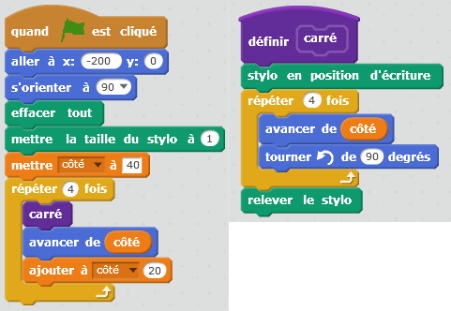
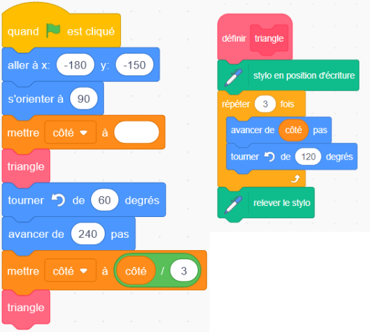

# Pierre de Rosette

{: .center width=480} 

Le script Scratch donné ci-dessus (issu d’une épreuve du DNB de 2018) a été traduit dans le langage Python en dessous.

```python linenums='1'
from turtle import *
speed('fast')

def carre():
    down()
    for i in range(4):
        forward(cote)
        left(90)
    up()

color('red')
goto(-200,0)
clear()
width(2)
cote = 40
for i in range(4):
    carre()
    forward(cote)
    cote = cote + 20
    if cote > 90:
        color('blue')

```

!!! example "À vous de jouer!"
    À l'aide de la traduction en Python du script Scratch précédent, traduire le script ci-dessous:

    {: .center width=480} 