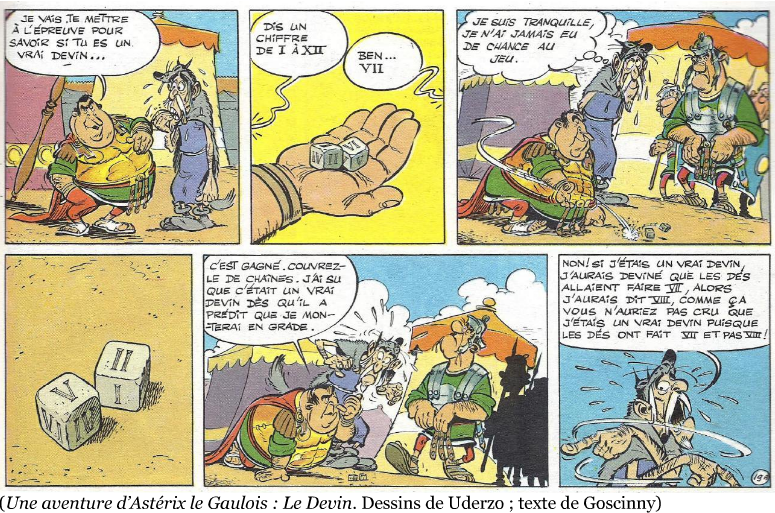

# Le devin

## Contexte du problème

{: .center} 

**Le devin a-t-il eu raison de choisir VII ?**

## Simulation

La fonction `randint(a, b)` du module `random` permet de choisir pseudo-aléatoirement un nombre entier (`int`) entre deux bornes a et b.

Pour simuler le lancer d'un dé, on pourra donc utiliser `randint(1, 6)`.

1. Créer une deuxième variable simulant le lancer d'un deuxième dé, puis afficher la somme des deux dés.

2. Créer une boucle pour simuler 100 lancers de deux dés.

3. Ajouter une variable «compteur» qui déterminera le nombre de lancers dont la somme vaut 7.

4. Afficher la proportion de lancers dont la somme vaut 7.

5. Transformer le code en une fonction `simul2lancers` qui prendra deux paramètres: `s` la somme cherchée et `n` le nombre de lancers.