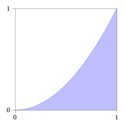
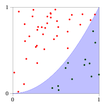
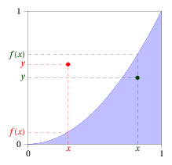

# Méthode de Monte-Carlo

**Objectif:** on veut estimer l'aire sous une courbe, par exemple l'aire sous la courbe de $f(x)=x^2$ sur l'intervalle $[0 ; 1]$.

{: .center} 

**Principe:** on choisit aléatoirement un (assez grand) nombre de points, et pour chacun on regarde s'il est au dessus ou en dessous de la courbe. La proportion de points en dessous de la courbe donne une estimation de l'aire cherchée.

{: .center} 

1. Si le point choisi aléatoirement est de coordonnées $(0,2 ; 0,8)$, est-il au dessus ou en dessous de la courbe? Pourquoi?

2. Si le point choisi aléatoirement est de coordonnées $(0,2 ; 0,01)$, est-il au dessus ou en dessous de la courbe? Pourquoi?

    ??? tip "Indication"
        {: .center} 

3. Compléter ligne 4 le code de la fonction `f`.

4. Ligne 7, définir une variable qui comptera le nombre de points en dessous de la courbe de $f$.

5. Compléter l'instruction `if` de la ligne 12 pour déterminer si le point $(x ; y)$ est au dessus ou en dessous de la courbe.

6. Actualiser la valeur de la variable compteur ligne 13.

7. Ligne 17, compléter la fonction print pour qu'elle affiche la proportion de points sous la courbe.

8. Comment obtenir une estimation plus précise?

```python linenums='1' title="À compléter dans l'éditeur"
import matplotlib.pyplot as plt
from random import random
def f(x):
    ...

n = 100
...

for k in range(n):
    x = random() # la fonction random permet de choisir 
    y = random() # aléatoirement un réel compris entre 0 et 1
    if ... :
        ...
        plt.plot(x, y, "og")
    else:
        plt.plot(x, y, "or")
print(...)
plt.show()
```
