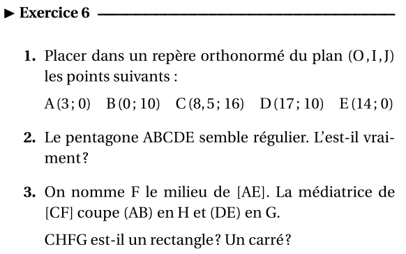

# Régulier ou pas?

!!! abstract "Objectif"
    Il s'agit de répondre à la question 2 de l'exercice 6 de la feuille «Chap.05 : Géométrie Plane».

    {: .center width=320} 

    Pour effectuer les calculs, on va écrire une fonction Python qui va calculer la distance entre deux points.


!!! example "Prequel 1: carré et racine carrée en Python"
    1. En Python, l'opérateur «puissance» est `#!py **`. Par exemple, pour calculer $5^3$, on tapera `#!py 5 ** 3`.

        Dans **la console** de Thonny, calculer $5^3$, $42^5$ et $16^2$.

    2. En revanche, il n'existe pas d'opérateur «racine carrée». Il faut l'importer d'une bibliothèque nommée `#!py math` (comme c'est étrange, non?). L'opérateur se nomme `#!py sqrt`, raccourci de *square root* en anglais (je ne vous fais pas l'injure de traduire).

        Taper les instructions suivantes dans la console de Thonny:

        ```python
        >>> from math import sqrt
        >>> sqrt(25)
        >>> sqrt(2)
        ```

        Que remarquez-vous?
    
    3. Dans **l'éditeur** de Thonny, copier-coller le programme suivant:

        ```python linenums='1'
        from math import sqrt

        for k in range(50):
            print(k)
        ```

        1. Que va-t-il faire? Le vérifier en l'exécutant.
        2. Le modifier pour qu'il affiche les racines carrées des nombres entiers compris entre 0 et 100.
    


!!! example "Prequel 2: rappel sur les fonctions"
    1. En Python, quel est le mot-clé qui permet de définir une fonction?
    2. Quel est celui qui permet de renvoyer une valeur?
    3. Comment indique-t-on le bloc d'instruction(s) qui constitue la fonction (on parle du corps de la fonction)?

!!! example "La fonction `#!py distance`"
    Si vous ne vous souvenez plus (:sob:) de la formule donnant la distance entre deux points, commencez par la retrouver dans la leçon.

    1. Combien de paramètres prend cette fonction? Trad: de combien de nombres a-t-on besoin pour pouvoir calculer?
    2. En nommant par exemple `#!py xA` pour $x_A$, écrire la fonction `#!py distance` demandée. *Indication: il n'y a qu'une seule instruction, on renvoie simplement la formule écrite à l'aide des paramètres et des opérateurs (attention néanmoins aux parenthèses).* 

        Vérifier dans la console avec les points de coordonnées $(2; 1)$ et $(6; 4)$, la fonction doit renvoyer la valeur `#!py 5.0`.

!!! example "La réponse à la question 2. de l'exercice 6"
    Utiliser en console - autant de fois qu'il le faut - la fonction `#!py distance` pour répondre.
